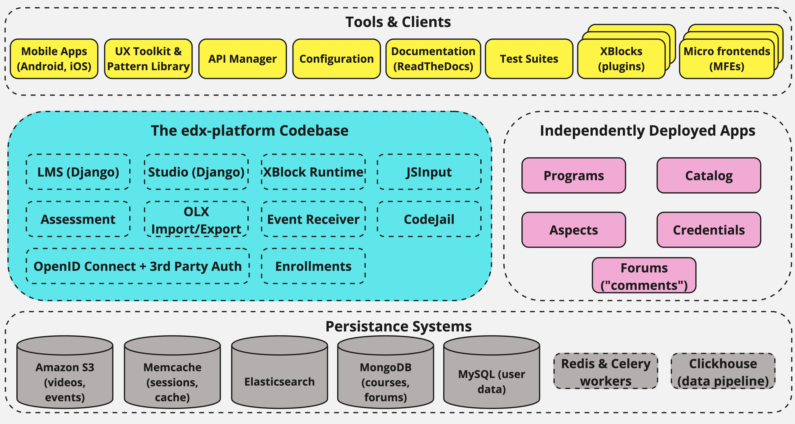

##############################
Open edX Platform Architecture
##############################

The Open edX project is a web-based platform for creating, delivering, and
analyzing online courses. It is the software that powers edx.org and many other
online education sites.

This page explains the architecture of the platform at a high level, without
getting into too many details.

********
Overview
********

There are a handful of major components in the Open edX project. Where
possible, these communicate using stable, documented APIs.

The centerpiece of the Open edX architecture is `edx-platform`_, which contains
the learning management and course authoring applications (LMS and Studio,
respectively).

This service is supported by a collection of other autonomous web services
called independently deployed applications (IDAs). Over time, we plan to
break out more of the existing edx-platform functions into new IDAs and MFEs
(micro front-ends). This strategy will help manage the complexity of the
edx-platform code base to make it as easy as possible for developers to approach
and contribute to the project.

..
  Note: The diagram source can be found here: https://miro.com/app/board/uXjVNVzVLPM=/?share_link_id=276497217755

Almost all of the server-side code in the Open edX project is in `Python`_,
with `Django`_ as the web application framework.

**************
Key Components
**************

================================
Learning Management System (LMS)
================================

The LMS is the experience that learners on Open edX sites see. It consists
of various functionalities such as a dashboard of courses, views of various
problem types, and progress pages for each course. Much of the LMS functionality,
such as the in-course experience, Open Response Assessment (ORA) grading, and user
profiles, is implemented via micro front-ends (MFEs).

LMS course content is written to a `Mongo`_ database.

======
Studio
======

Studio is the course authoring environment. Course teams use it to create and
update courses. Studio writes its courses to the same Mongo database that the
LMS uses.

===========
Discussions
===========

Course discussions are implemented in the `Discussions MFE <https://github.com/openedx/frontend-app-discussions>`_.
The discussions app allows learners and course staff interact with one another
within a course run.

===========
Mobile Apps
===========

The Open edX project includes a mobile application, available for iOS and
Android, that allows learners to watch course videos and more. The Open edX
community is actively enhancing the mobile apps.

=========
Analytics
=========

The Data Working Group is currently building an analytics solution called `Aspects <https://github.com/openedx/openedx-aspects>`_.

===============
Background Work
===============

A number of tasks are large enough that they are performed by separate
background workers, rather than in the web applications themselves. This work
is queued and distributed using `Celery`_ and `Redis`_. Examples of queued
work include:

* Grading entire courses
* Sending bulk emails (with Amazon SES)
* Generating answer distribution reports
* Producing end-of-course certificates

======
Search
======

The Open edX project uses `Elasticsearch`_ for searching in multiple contexts,
including course search and the comments service.

================
Other Components
================

In addition to the components detailed above, the Open edX project also has
services for other capabilities, such as one that manages e-commerce functions
like order work flows and coupons.

.. _edx-platform: https://github.com/openedx/edx-platform
.. _Python: https://www.python.org/
.. _Django: https://www.djangoproject.com/
.. _Mongo: https://www.mongodb.com/
.. _Celery: http://www.celeryproject.org/
.. _Redis: https://redis.io/
.. _Elasticsearch: https://www.elastic.co/
